# Nano119 CPU

## CPU features:
-	4 K byte ROM for code space
-	2 K word RAM for data space
-	256 words stack
-	Direct addressing operation
-	ALU with 16 bits operands and 32-bit result
-	119 instructions
-	Dedicated I/O busses to communicate with generic peripherals 
-	Interrupt capability
-	Configurable operating speed

## How it works

A simple architecture for practical implementation of a central processing unit (CPU) is proposed as teaching resource, to experiment and verify the fundamental concepts of a simple computer architecture with its instruction set (in this case, 119 instructions). Full functional VHDL code is available in this repository, ready to be tested on a Basys3 development board.
A block diagram for the proposed Harvard architecture, with minimal functional blocks, is presented in the following figure:  

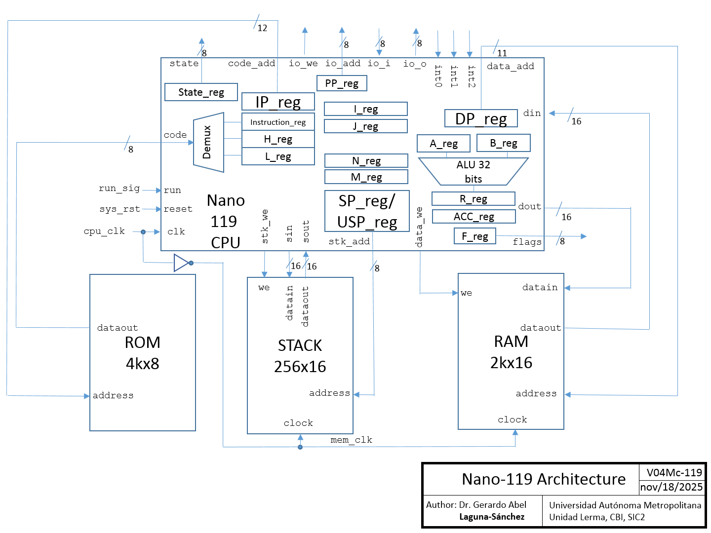

### Architectural overview
The proposed CPU uses a Harvard architecture in which program, data and IO are accessed from separate busses. The data word size is 16 bits while the code Word size is 8 bits. The 16-bit ALU is a general-purpose arithmetic and logic unit and its result is always stored in the 32-bit R register. 
The arithmetic instructions affect the values of the following flags:
-	Z16: 16 bits Zero / Equal
-	N16: 16 bits negative / Less tan
-	O16: 16 bits overflow
-	CO16: 16 bits catastrophic overflow
-	Z32: 32 bits Zero
-	N32: 32 bits negative
-	O32: 32 bits overflow
-	CO32: 32 bits catastrophic overflow
Z16, N16, O16 and CO16 flags are set based on the 16 least significant bits of R register, while Z32, N32, O32 and CO32 flags are set based on the whole R register. The catastrophic overflow is set when the result sign does not correspond with the expected. The logic instructions only affect the Z16 and Z32 flags.

The architecture includes the following registers:
-	State register: To track the CPU micro-states
-	IP register: 12-bit Instruction Pointer, to access the code space     
-	DP register: 11-bit Data Pointer, to access the data space
-	SP register: 8-bit Stack Pointer, to access the stack space by means push and pop instructions
-	USP register: 8-bit User Stack Pointer, to access the stack space in a random way
-	PP register: 8-bit Peripheral Pointer, to access the I/O space
-	A and B registers: Generic 16-bit operand registers
-	R register: Generic 32-bit result register
-	Acc register: 32-bit result register for AC and MAC instructions
-	I and J registers: 16-bit counting registers for iteration loops
-	N and M registers: 16-bit target count registers for iteration loops
Additionally, the architecture includes the following internal registers that are not directly accessible by the user:
-	F register: 8-bit Flags register
-	Instruction, H and L registers: 8-bit registers, used at instruction decode process to store op code and parameters values

### Program memory organization
The CPU has 12-bit instruction pointer capable of addressing a 4k x 8 program. The reset vector is at 0x0000, while the interrupt vectors are at 0x3FF7, 0x3FFA and 0x3FFD, for Int2, Int1 and Int0, respectively.

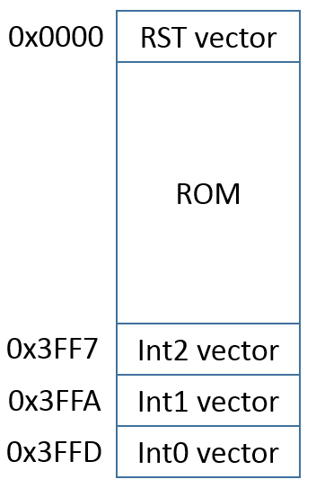

### Stack
The CPU has a 256- level deep x 16-bit wide stack. The push instruction first stores the data and later increment de SP. The pop instruction first decrements de SP and later restore the data.
The user can access the stack space by means push/pop instructions or with data transfers by means the USP pointer. The instruction call automatically pushes the IP in the stack and the ret instruction pops it to continue the program Flow. 
In the case of an interruption, if it is detected while running a program, the system automatically pushes the IP, R and F registers, while reti instruction pops all these.

### I/O interface
The CPU provides dedicated buses to access generic peripherals by means In and out instructions. The user can add a required peripheral with this interface. In the current implementation, it has been reserved the first two locations of I/O space, i.e. 0x00 and 0x01, to control the 3 available interrupts.

### Interrupts
The CPU has 3 external sources of interrupt, denoted as Int0, Int1 and Int2. The highest priority is assigned to Int0, while the lowest priority is assigned to Int2. If it is enabled, an interruption can be served while a program is executed, but also if the CPU is at stop status. When the interrupt service is required while a program is executed, it implies the usual context saving process. On the other hand, when the interrupt service is required while a program is stopped, it does not save the context.  The registers to control these interrupts are mapped in the first two locations of the I/O space:
-	IE reg: Interrupt Enable register, mapped at 0x00 of I/O space
-	IF reg: Interrupt Flags register, mapped at 0x01 of I/O space

To enable an interruption, it is necessary to set the corresponding bit in IE register. When an interruption is enabled and it occurs (a positive edge is detected in the interrupt pin), the system automatically set the corresponding interruption flag in IF register and no other interrupt can be attended. Then, when the interrupt service routine finishes its task, before reti instruction, the interrupt flag must be cleaned.

### Instruction set
The proposed instruction set is can be conveniently codified with bytes. The following tables summarizes the proposed instruction codification:

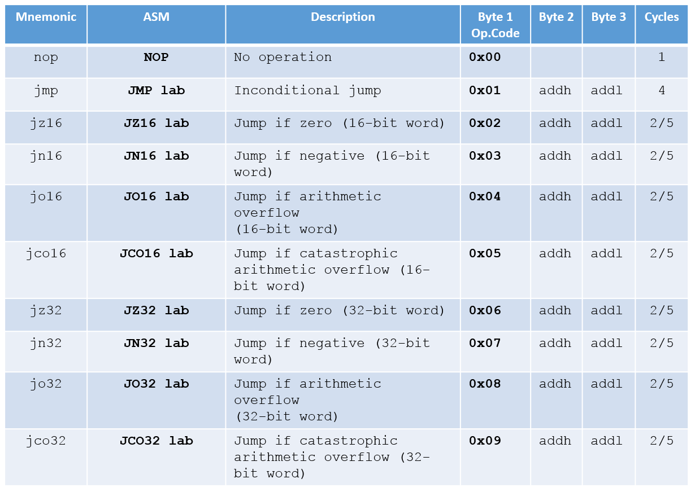
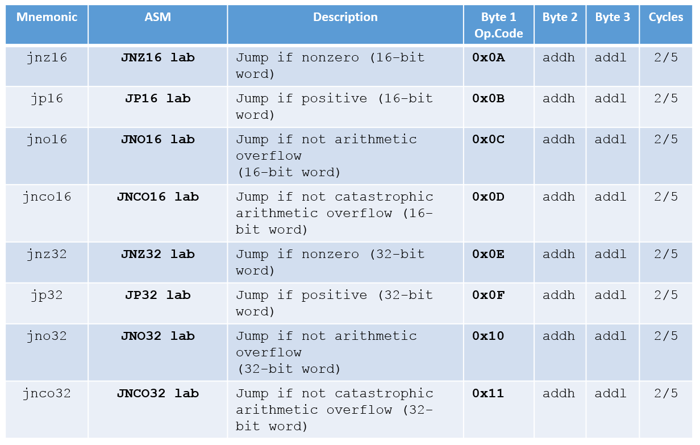
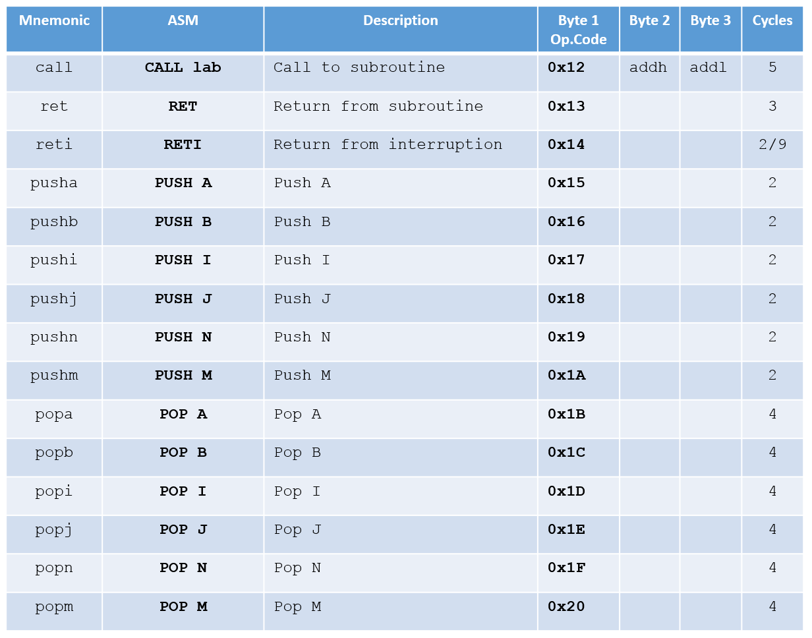
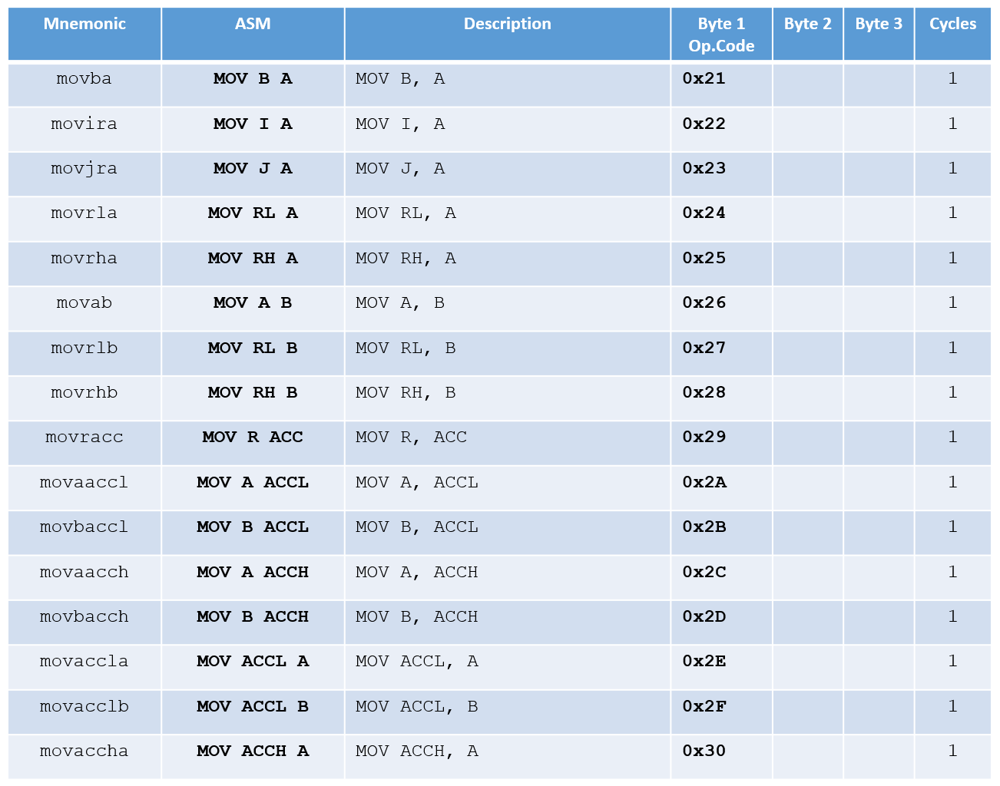
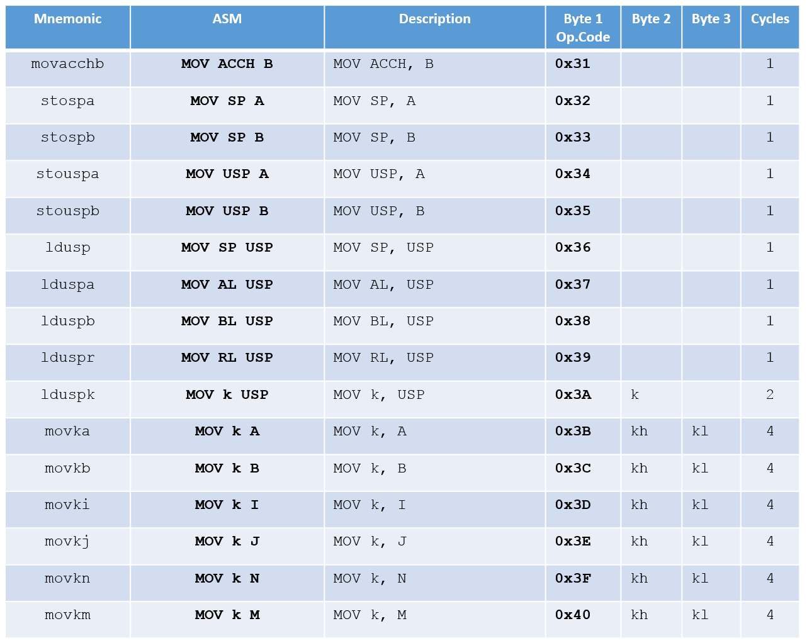
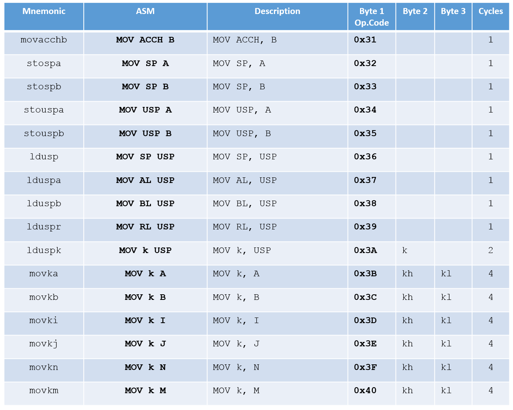
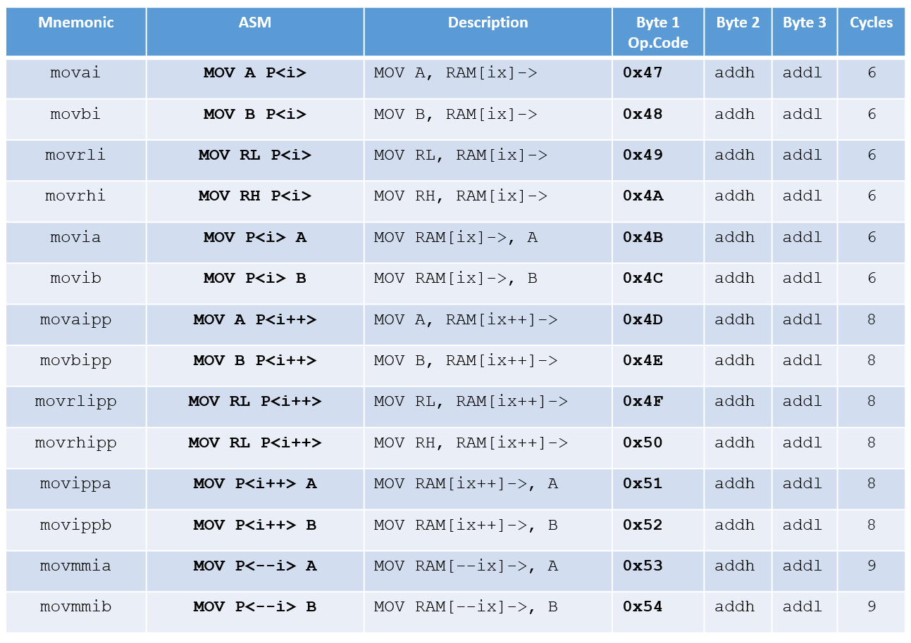
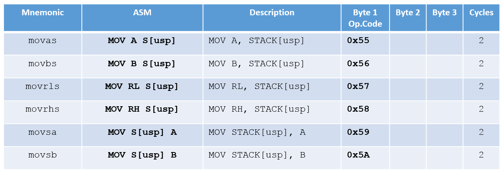
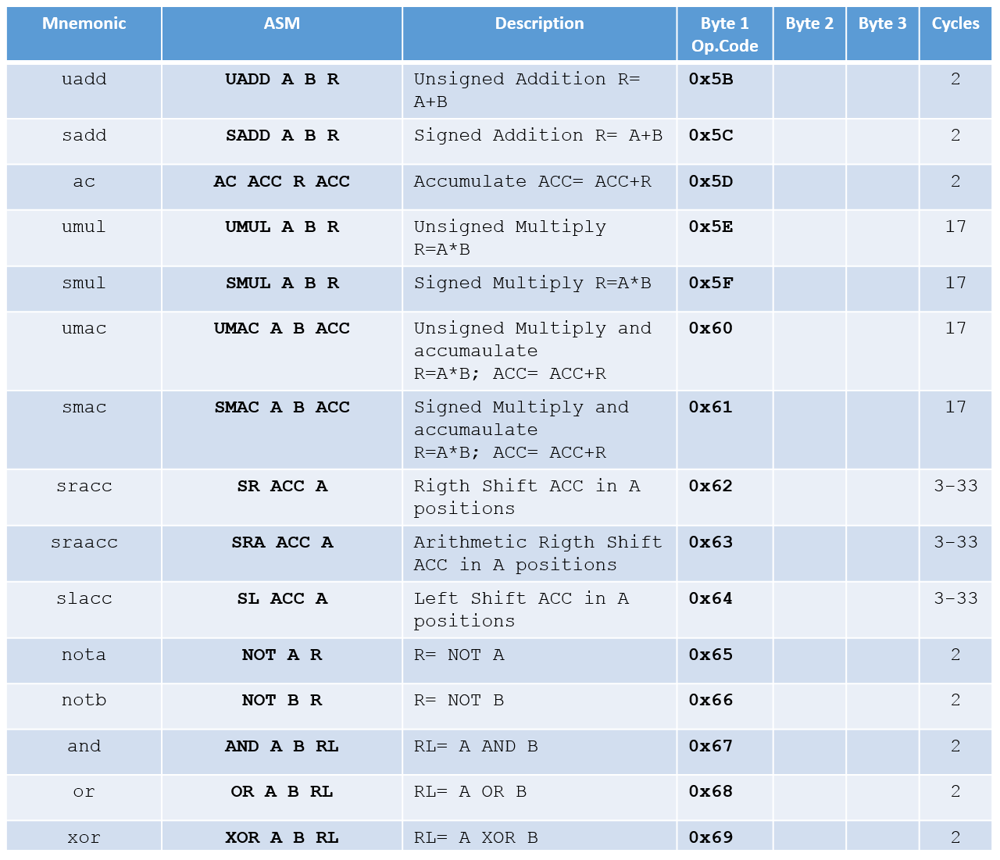
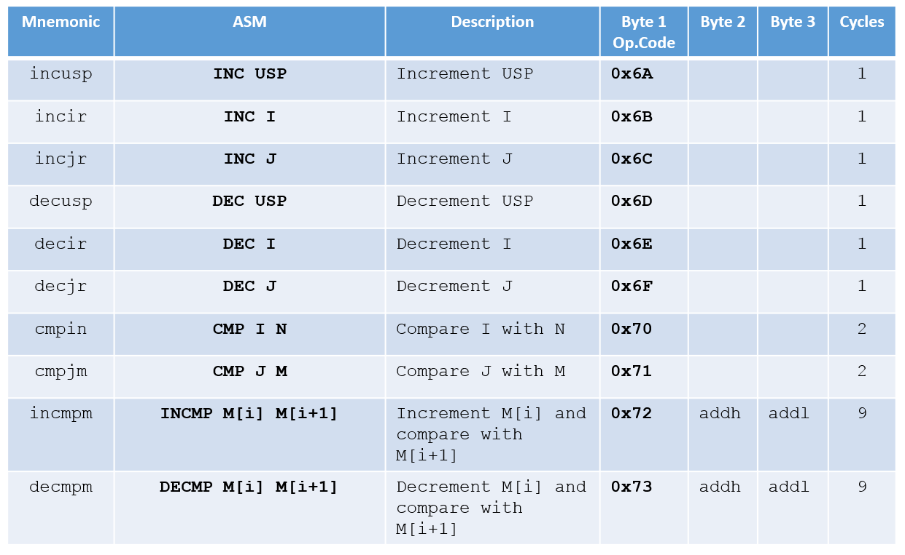
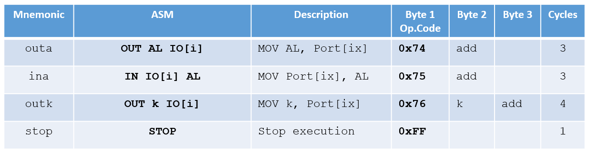

## How to test

In practice, to work with the input and output ports of a Basys3 board, the entire system has been packaged in the Nano_mcsys_119 module, which is represented schematically below:

Within the Nano_mcsys_119 module, the parameter CPU_CLK_SEL is used to select, by means a multiplexor, the CPU clock signal that will be used to drive the machine cycles (fetch-decode-execute). Assuming a 100 MHz system clock, the possible CPU frequencies are showed in the following table:

For more details on system implementation, see the Nano_mcsys_119.vhd file.

The ROM is implemented with a constant array (CODE_ROM) that includes the following demo program:

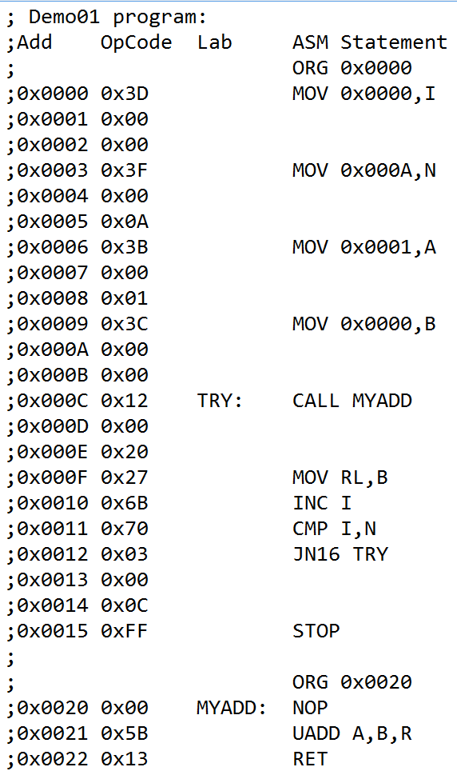

Of course, the user can customize the ROM code, to include an own program, in the Nano_mcsys_119.vhd file. 
The project uses the I/O resources of a Basys3 board. To see the I/O connections for the Nano_mcsys_119 module, go to Top_Basys3.vhd file. 
Once synthetized and downloaded the bitstream on destination FPGA, the code execution starts with signal RUN=1.  
